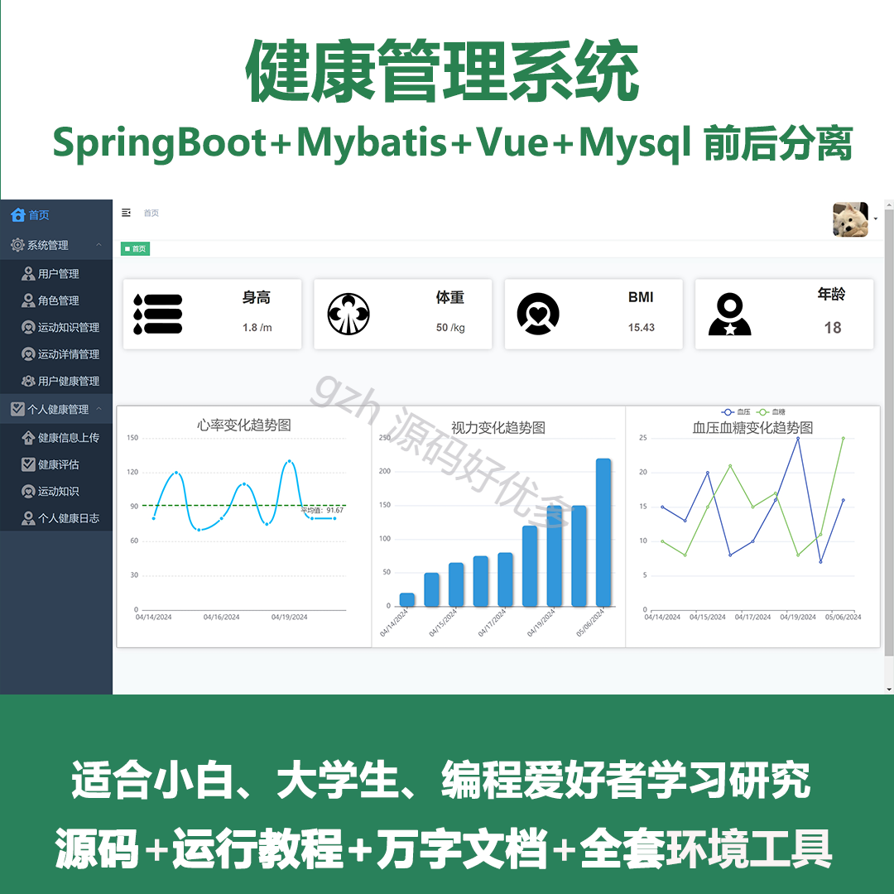
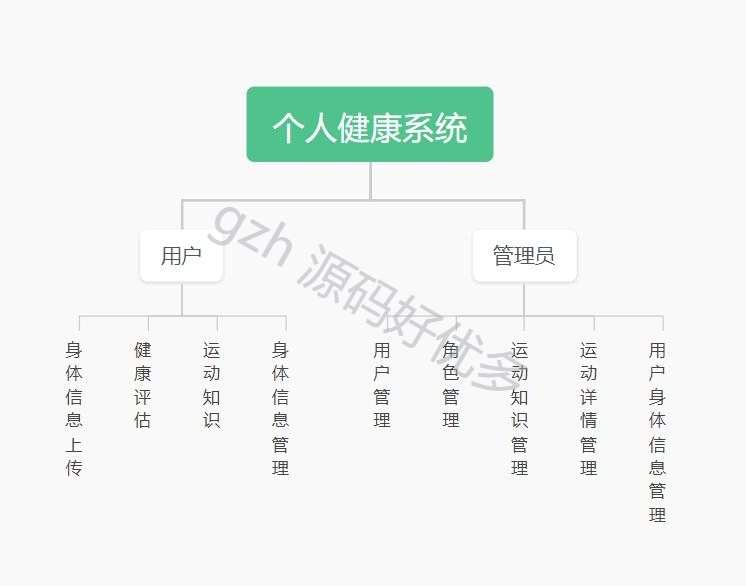
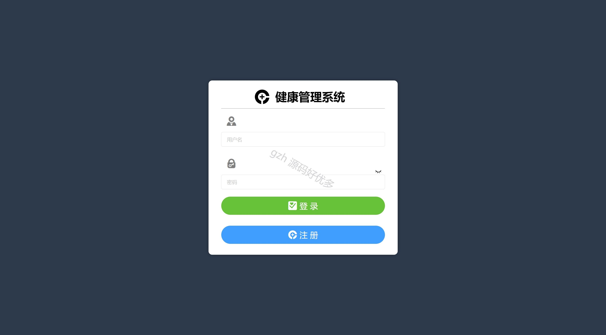
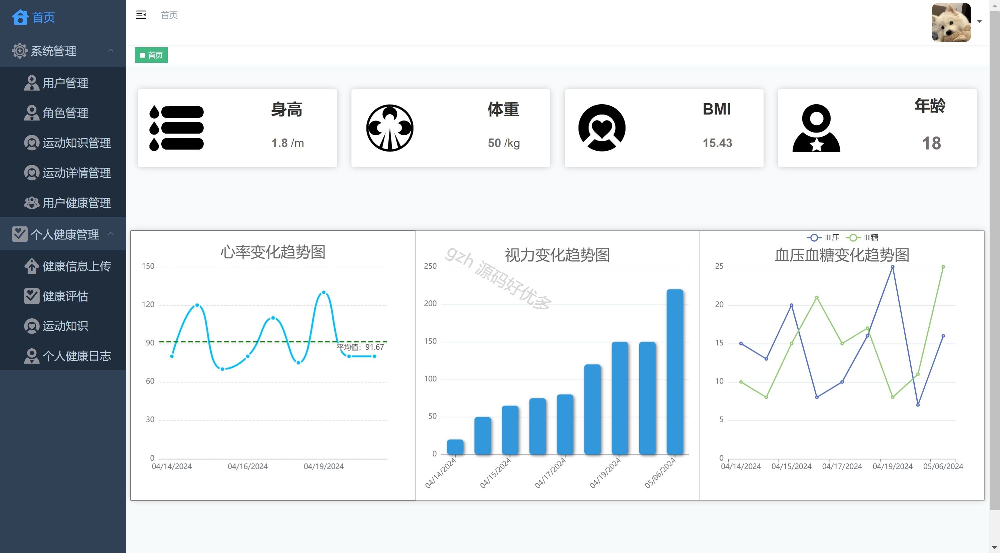
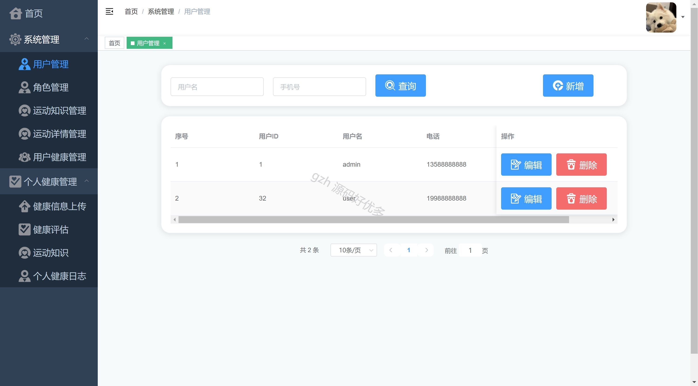
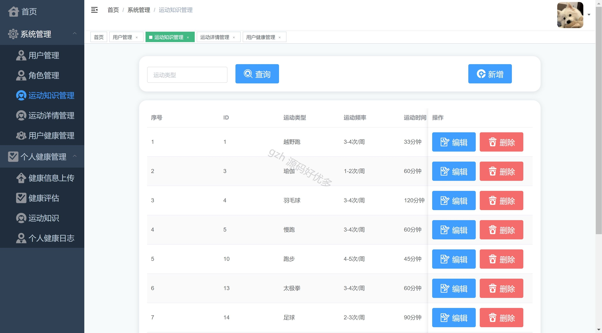
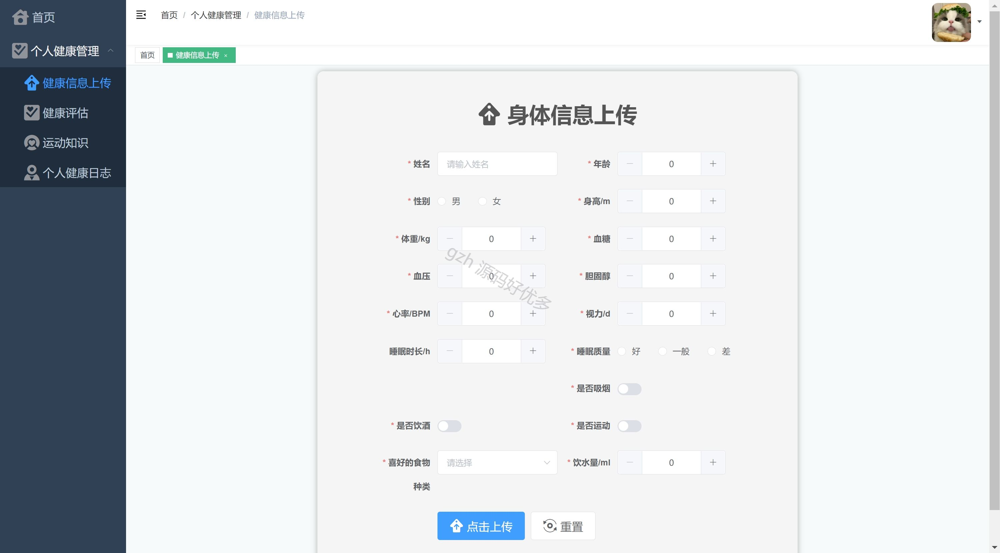
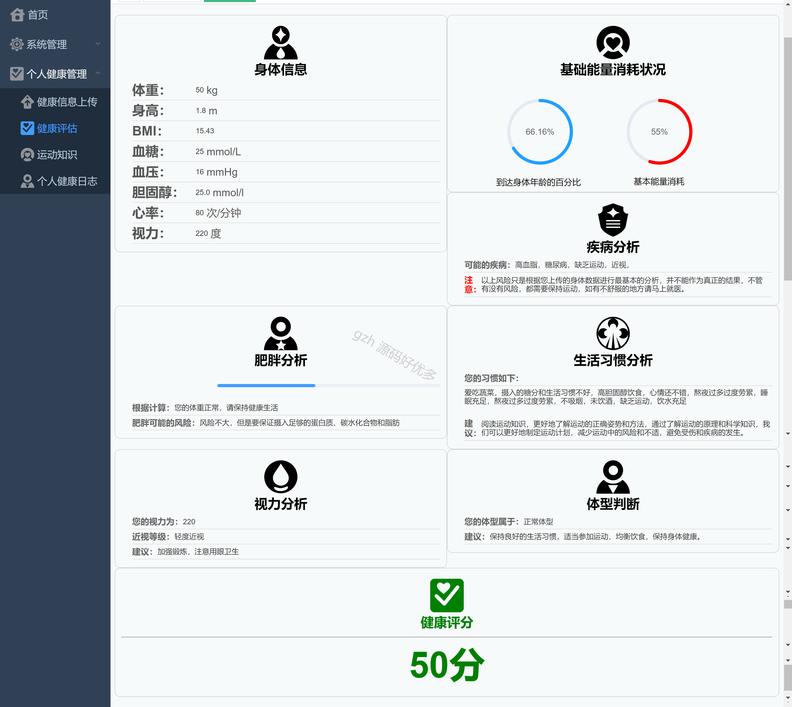
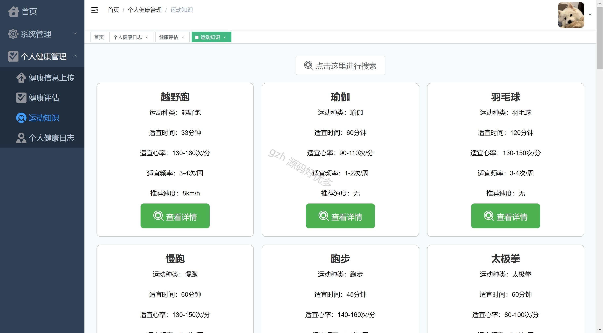
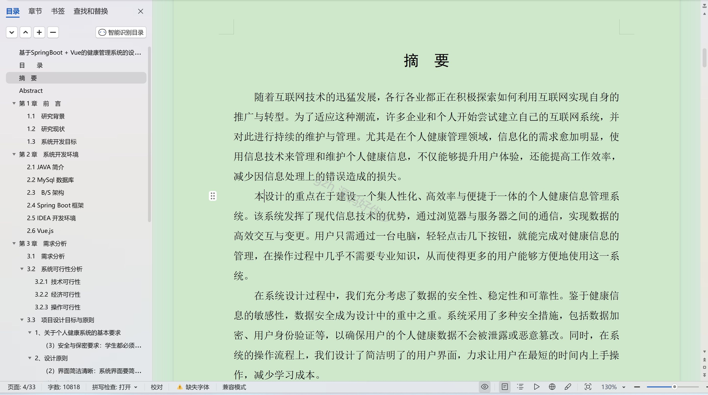

# springbootA351
springbootA351健康管理系统LW
 
## 查看主页获取源码

### 一、作品包含

源码+数据库+设计文档万字+全套环境和工具资源+部署教程

### 二、项目技术

前端技术：Html、Css、Js、Vue、Element-ui

数据库：MySQL

后端技术：Java、Spring Boot、MyBatis

  

### 三、运行环境

开发工具：IDEA/eclipse

数据库：MySQL8.0

数据库管理工具：Navicat10以上版本

环境配置软件： JDK1.8+Maven3.6.3

前端Nodejs：16

### 四、项目介绍
项目编号：springbootA351

在现代社会快节奏的生活和日益增大的压力之下，人们对健康的关注度不断提升。健康管理系统由此应运而生。随着医疗技术的进步和信息技术的飞速发展，传统的健康管理模式已难以满足人们对个性化、精准化健康服务的需求。健康数据并进行分析，助力人们更好地管理自己的健康，提高生活质量。

系统分为管理员和用户
管理员的功能：登录、首页、用户管理、角色管理、运动知识管理、运动详情管理、用户身体信息管理。
用户的功能：登录注册、首页、身体信息上传、健康评估、运动知识、身体信息管理。

### 五、运行截图

  
